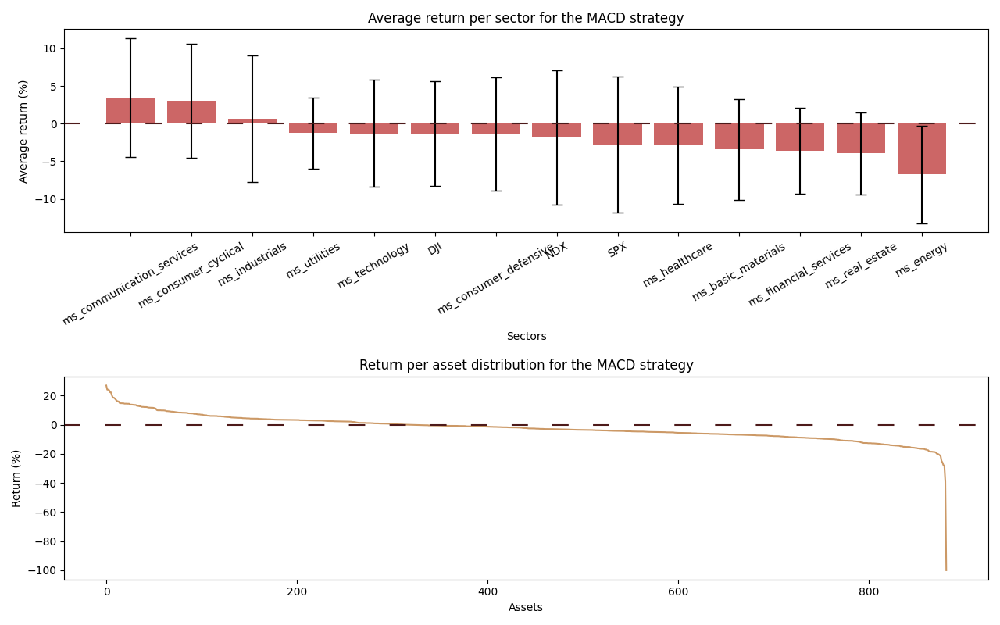
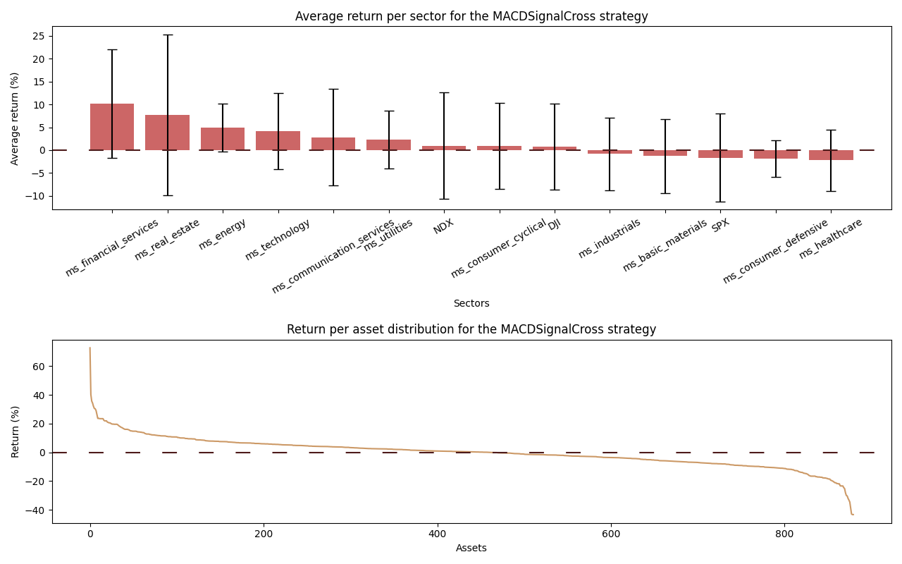

# AlgoTrading-Robot
With the aim of self-learned education, I delved into the creation of my own AlgoTrading Robot. In this project, while I would study the basics of trading principles and strategies, my goal was to create a fully functional and autonomous trading robot in my local machine. In what follows, I discuss the steps I took to achieve this. Note that I used a Mac High Sierra 10.13.6 for this project.

### Architecture of the project
#### The Algorithm
The conceptual mechanics of the robot are layed out below. The data will be loaded from the yfinance module, which gets the data from Yahoo Finance. The online broker chosen for this project was Alpaca, due to its well documented API and ease of use.

1. Choose a few assets in the market to follow. This can be arbitrary, or select a few assets every few months based on some backtesting performance measure. This is discussed further below.
2. Choose the time interval to look at the data and perform actions. Again, this can be arbitrary or set based on some backtesting perfomance measure.
3. At a certain frequency, matching the chosen time interval, the algorithm should load the new closing price of the selected assets as soon as its available.
<details>
<summary>Click to see the code snippet</summary>
  
```python
def GetUpdatedAssetData(maxattempts: int, ticker: str, period: str, interval: str, MACDfastperiod: int =12, MACDslowperiod: int =26, MACDsignalperiod: int =9):
    '''
    Returns a pandas time series DataFrame containing the most recent update of the asset's historical closing price and MACD. If the 
    data is not accessible, its size too small or not yet updated, an exception is raised.

    Keywords arguments:
    maxattempts -- Maximum amount of attempts to find the updated data of the asset.
    ticker -- Ticker of the asset.
    period -- Period of time worth of data. Accepts 1d, 5d, 1mo, 60d, 3mo, 6mo, 1y, 2y, 5y, 10y, ytd and max.
    interval -- Interval at which the data points are taken. Accepts 1m, 2m, 5m, 15m, 30m, 60m, 90m, 1h, 1d, 5d.
    MACDfastperiod -- Amount of rolling points to take as the fast period for the MACD calculation. Default is 12.
    MACDslowperiod -- Amount of rolling points to take as the slow period for the MACD calculation. Default is 26.
    MACDsignalperiod -- Amount of rolling points to calculate the MACD signal line. Default is 9.
    '''
    data=GetAssetData(ticker, period, interval, MACDfastperiod, MACDslowperiod, MACDsignalperiod)
    
    attempt=0
    currenttime=datetime.now(pytz.timezone('Europe/Madrid'))
    # currenttime=currenttime.replace(tzinfo=timezone.utc) #Make datetime timezone aware 
    intervalduration=pd.Timedelta(interval)
    timelastdatapoint=data.index[-1]

    #Get the asset's data while the current time is not between the time of the last and next data point, for a maximum of maxattempts tries 
    while attempt < maxattempts and not timelastdatapoint <= currenttime <= timelastdatapoint + intervalduration:
        attempt += 1
        time.sleep(3)
        data=GetAssetData(ticker, period, interval, MACDfastperiod, MACDslowperiod, MACDsignalperiod)
        timelastdatapoint=data.index[-1]
    
    if attempt == maxattempts:
        raise Exception(f'Maximum amount of tries ({maxattempts}) to get the updated data for {ticker} reached.')
    
    return data
```
</details>

4. The new data is then analyzed and a buy, sell or continue signal is generated after defining a trading strategy in another function.
<details>
<summary>Click to see the code snippet</summary>

```python
def GenerateMarketOrderSignal(strategy: str, data: pd.DataFrame, datapoint: int =-1):
    '''
    Returns 'buy', 'sell' or None as a signal.

    Keyword arguments:
    strategy -- Strategy employed for which the signal should be generated. Accepts 'MACDZeroCross' and 'MACDSignalCross'.
        'MACDZeroCross': Generate 'buy' signal if the MACD goes from negative to positive. Generate 'sell' signal
        if the MACD goes from positive to negative.
        'MACDSignalCross': Generate 'buy' signal if the MACD's signal line goes from less than to greater than 
        the MACD. Generate 'sell' signal if the MACD's signal line goes from greater than to less than the MACD.
    data -- Asset's (historical) data from yfinance. Obtainable through GetAssetData.
    datapoint -- The point for which the signal should be generated, useful to iterate through the
        data points while backtesting. If the function is used in live mode, leave the default -1.
    '''
    if 'MACD' in strategy:
        MACD=data['MACD']
        MACDsignal=data['MACDSignal']

        if strategy == 'MACDZeroCross':
            if MACD.iloc[datapoint-1]<0 and MACD.iloc[datapoint]>0:
                return 'buy'
            elif MACD.iloc[datapoint-1]>0 and MACD.iloc[datapoint]<0:
                return 'sell'
            else:
                return None
            
        elif strategy == 'MACDSignalCross':
            if MACDsignal.iloc[datapoint-1]<MACD.iloc[datapoint-1] and MACDsignal.iloc[datapoint]>MACD.iloc[datapoint]:
                return 'buy'
            elif MACDsignal.iloc[datapoint-1]>MACD.iloc[datapoint-1] and MACDsignal.iloc[datapoint]<MACD.iloc[datapoint]:
                return 'sell'
            else:
                return None
```
</details>

5. If the signal is buy or sell, the algorithm connects with the online broker through its API and places a market order.
<details>
<summary>Click to see the code snippet</summary>

```python
def GetAlpacaConnection() -> tuple([alpaca.trading.client.TradingClient, alpaca.trading.models.TradeAccount]):
    '''
    Connects to Alpaca's API and returns a TradingClient and TradeAccount object.
    '''
    api_key='***'
    api_secret='***'
    trader=TradingClient(api_key, api_secret, paper=True)
    account=trader.get_account()
    return trader, account
```
```python
def PlaceMarketOrder(trader: alpaca.trading.client.TradingClient, ticker: str, type: str, notional: float, trailpercent: int =10):
    '''
    Submits a buy, buy and trail stop, or sell order through the API. Returns the relevant market orders.

    Keyword arguments:
    trader -- alpaca.trading.client.TradingClient object obtained by the connection with Alpaca's API. Can be obtained by GetAlpacaConnection().
    ticker -- Ticker of the asset.
    type -- Order type. Accepts 'buy', 'buy&trailstop' or 'sell'.
    notional -- Amount of money to invest in asset.
    trailpercent -- Percentage from the asset's trailing maximum value at which the stop loss would trigger.
    '''
    if type == 'buy':
        market_order_data=MarketOrderRequest(symbol=ticker, notional=notional, side=OrderSide.BUY, time_in_force=TimeInForce.DAY)
        market_order=trader.submit_order(order_data=market_order_data)
        return market_order

    elif type == 'buy&trailstop':
        market_buyorder_data=MarketOrderRequest(symbol=ticker, notional=notional, side=OrderSide.BUY, time_in_force=TimeInForce.DAY)
        market_buyorder=trader.submit_order(order_data=market_buyorder_data)    

        maxattempts=5
        for attempt in range(maxattempts):
            time.sleep(1)
            try:
                owned=trader.get_open_position(ticker)
            except alpaca.commom.exceptions.APIError as e:
                continue

            owned_quantity=owned.qty    
            market_trailstoporder_data=TrailingStopOrderRequest(symbol=ticker, qty=owned_quantity, side=OrderSide.SELL,
                                                        time_in_force=TimeInForce.DAY, trailpercent=trailpercent) #sell if price is 99% of max if trailpercent=1
            market_trailstoporder=trader.submit_order(order_data=market_trailstoporder_data)
            return market_buyorder, market_trailstoporder

    elif type == 'sell':
        market_order=trader.close_position(ticker)
        return market_order
    
    else:
        raise Exception(f'Wrong input for type argument. Expected "buy", "buy&trailstop" or "sell", got {type} instead.')
```
```python
def AlgoTradingLive(strategy: str, tickers: list[str], period: str, interval: str, diversifyingdepth: int, buyingpowerpercentage: float, trailpercent: int,
                     MACDfastperiod: int =12, MACDslowperiod: int =26, MACDsignalperiod: int =9):
    '''
    Places market orders through Alpaca's API.

    Keyword arguments:
    strategy -- Strategy employed for which the signal should be generated. Accepts 'MACDZeroCross' and 'MACDSignalCross'.
        'MACDZeroCross': Generate 'buy' signal if the MACD goes from negative to positive. Generate 'sell' signal
        if the MACD goes from positive to negative.
        'MACDSignalCross': Generate 'buy' signal if the MACD's signal line goes from less than to greater than 
        the MACD. Generate 'sell' signal if the MACD's signal line goes from greater than to less than the MACD.
    tickers -- List of tickers to keep track of. Will check buy and sell conditions for these.
    period -- Period of time worth of data. Accepts 1d, 5d, 1mo, 60d, 3mo, 6mo, 1y, 2y, 5y, 10y, ytd and max.
    interval -- Interval at which the data points are taken. Accepts 1m, 2m, 5m, 15m, 30m, 60m, 90m, 1h, 1d, 5d.
    diversifyingdepth -- Maximum amount of assets that can be owned. Equally distributes the buying power among them.
    buyingpowerpercentage -- Relative amount of the buying power that can be used. Useful to diversify the strategies
        used or limit the amount of money to invest. Accepts a float between 0 and 1.
    trailpercent -- Percentage from the asset's trailing maximum value at which the stop loss would trigger.
    MACDfastperiod -- Amount of rolling points to take as the fast period for the MACD calculation. Default is 12.
    MACDslowperiod -- Amount of rolling points to take as the slow period for the MACD calculation. Default is 26.
    MACDsignalperiod -- Amount of rolling points to calculate the MACD signal line. Default is 9.
    '''
    #Getting relevant information from the Alpaca's account
    trader, account=GetAlpacaConnection()

    portfolio=trader.get_all_positions()
    buyingpower=float(account.buying_power)*buyingpowerpercentage
    ordersdata=GetOrdersRequest(status=QueryOrderStatus.OPEN, side=OrderSide.BUY, limit=10, nested=True)
    openbuyorders=trader.get_orders(filter=ordersdata)
    openbuyordersassets=[asset.symbol for asset in openbuyorders]
    ownedassets=[asset.symbol for asset in portfolio]

    #Extends the tickers list with the open positions in the portfolio, to ensure they are still being tracked until they are sold
    #in the eventuality that the tickers list changes 
    tickers.extend(ownedassets)
    tickers=list(set(tickers)) #Removes duplicates
    for ticker in tickers:
        try:
            data=GetUpdatedAssetData(8, ticker, period, interval, MACDfastperiod, MACDslowperiod, MACDsignalperiod)
        except Exception as e:
            continue
        
        #If the amount of assets owned or on open order does not reach the diversiyinf depth and the asset is not owned
        #and is not an open buy order and there is a buy signal: buy
        if diversifyingdepth > (len(portfolio) + len(openbuyorders)) and ticker not in ownedassets \
            and ticker not in openbuyordersassets and GenerateMarketOrderSignal(strategy, data) == 'buy':
            #Divides the buying power in equal parts to potentially buy diversifyingdepth assets. Truncates to the second decimal place
            investingquantity=round(buyingpower / (diversifyingdepth - len(portfolio) - len(openbuyorders)), 2)//0.01*0.01 
            try: 
                buyorder, trailstoporder=PlaceMarketOrder(trader, ticker, 'buy&trailstop', investingquantity, trailpercent)
                return buyorder, trailstoporder
            except Exception as e:
                continue
        
        #If the asset is owned and there is a sell signal: close position (sell)
        elif ticker in ownedassets and GenerateMarketOrderSignal(strategy, data) == 'sell':
            sellorder=PlaceMarketOrder(trader, ticker, 'sell', investingquantity)
            return sellorder
```
</details>

6. Throughout this process, log entries are generated on a log file to keep track of the actions performed and for troubleshooting.

#### The Deployment
Ideally, the whole algorithm would have been deployed using some cloud solutions or a Raspberry Pi. However, I decided to maintain the project cost-free, thus deciding to find a patchwork solution on my local machine. Nonetheless, this is done in such manner only because the project is mainly educational and being well aware the risks and downsides of this solution.

The idea is that the robot should be completely autonomous, meaning that it should wake up at the start of the market day, perform the required actions throughout the day and turn off at the end of it, without my input, logging into the computer or else. To achieve this I did the following.

1. Set my computer to wake up and go to sleep at market opening and closing, respectively.
2. Create a bash script and put it into my LaunchDaemons, which continuously runs the script in the background without needing to log in. If it's the market opening time, it will disable the automatic sleep of my computer, so it stays on and running. If the time of day is within market hours, the bash script runs the python script containing the trading algorithm, which may perfom some actions. Otherwise, it goes to sleep to save the computer of continuously running the bash script. At market closing time, it re-activates the sleep of my computer, so it is able to shut down.
<details>
<summary>Click to see the code snippet</summary>

```bash
#!/bin/bash

logpath="/tmp/Projects/ShellOutput.log"
log() {
  echo "$(date +'%Y-%m-%d %H:%M:%S') $1" >> $logpath
}
log "PID: $$"

log "Shell script started!"
# Get the current hour in 24-hour format
current_hour=$(date +%H)
current_minute=$(date +%M)
current_minute=${current_minute#0}
current_day=$(date +%u) # 1=Monday, 2=Tuesday, ..., 7=Sunday

# source /path/to/your/python/environment/bin/activate
# log "Starting python script"
# sudo /Library/Frameworks/Python.framework/Versions/3.11/bin/python3 /Users/lucasvanderhorst/AlgoTrading/AlgorithmicTrading.py


#As soon as computer wakes, disables sleep. If run "sudo visudo" in the terminal, the sudoers file can be accessed, where 
#the password for sudo command has been disabled (or already granted when running sudo visudo)
if [ "$current_hour" == 15 ]; then
    sudo pmset disablesleep 1
    log "Sleep has been deactivated"
fi

if [ "$current_hour" == 22 ]; then
    sudo pmset disablesleep 0
    log "Sleep has been activated again"
fi

log "Checking if it is the right time to run python script"
# Check if the current hour is within the desired time range (15:30 to 22:00) on weekdays
if [ "$current_hour" -ge 15 ] && [ "$current_hour" -lt 22 ] && [ "$current_day" -ge 1 ] && [ "$current_day" -le 5 ]; then
    # Check if the current minute is a multiple of 5 (to run every 5 minutes)
    if [ "$((current_minute % 5))" == 0 ]; then
        # Run the Python script
        log "Running Python scrip AlgorithmicTrading.py"
        sudo /Library/Frameworks/Python.framework/Versions/3.11/bin/python3 /Users/lucasvanderhorst/AlgoTrading/AlgorithmicTrading.py
        log "Python script AlgorithmicTrading.py should have been run. Sleeping for 3 minutes"
        echo >> $logpath        
        sleep 180
    else 
        log "The current time is within the python's script allowed time range, but not yet at the required interval time. Sleeping for 15 seconds"
        echo >> $logpath    
        sleep 15
    fi

else
    #Make it sleep longer during the weekends
    #Sleep for some time before LaunchDaemons runs the script again. To save on power consumption
    if [ "$current_hour" -lt 15 ] || [ "$current_hour" -ge 22 ]; then
        log "The current time is outside the python's script allowed time range. Sleeping for 30 minutes"
        echo >> $logpath
        sleep 1800
    fi
fi
```
</details>

3. Putting a sleeping element in the bash script created an issue. If I was using my computer and it went to sleep for a period of time, and I then put my computer to sleep because I am done using it, the sleep timer pauses and continues with the automatic wake of my computer. Since the script if sleeping still, it does not deactivate the automatic sleeping of the computer, which turns off after a few seconds. Thus rose the need of a second bash script to keep running in the background as well, whose sole task is to kill the sleep timer of the original bash script if the time of day is that of the computer wake time. In summary, the computer wakes up a bit before market opening, bash script 2 kills the sleep of bash script 1, and then bash script 1 disables the automatic computer sleep and runs the trading algorithm for the remaining of the market day.
<details>
<summary>Click to see the code snippet</summary>

```bash
#!/bin/bash
logpath="/tmp/Projects/ShellOutput.log"
log() {
  echo "$(date +'%Y-%m-%d %H:%M:%S') $1" >> $logpath
}
pid=$(grep "PID:" /tmp/Projects/ShellOutput.log | tail -n 1 | awk '{print $4}')

log 'Sleep Killer is hunting'

# Get the current hour in 24-hour format
current_hour=$(date +%H)

if [ $current_hour == 15 ]; then
    log "Killing ScriptRunner.sh to ensure is it not sleeping. It should run again straight away and disable sleep."
    echo >> $logpath
    pkill -P $pid
    sleep 3600
else
    log "I'm still thirsty for blood, but will rest for 2 seconds"
    sleep 2
fi
```

</details>

4. Lastly, because I need user permissions (give a password) every time I run a sleep disabeling command, I had to grant permission to these commands in my sudeors file.

While I learned a lot about bash scripting and terminal use, this is far from the ideal solution. Here, I depend on a proper wifi connection without issues, and for the computer to automatically turn on, it needs to be connected to a charging point. Meaning, if I forget to leave the charging on, go on a trip, or leave the house with the laptop and so forth, the computer will not wake up and miss a few hours of market time, which may be critical if it misses a sell signal. Ideally, the algorithm should be deployed in the cloud, without any local dependancy on my computer or environment.

#### Additional Feautures
1. Above it was mentioned that some arbitrary choices could be more educated, rather than randomly chosen. In particular, after building a backtesting function, it was easy to perform a grid search for the best performing market sector, the best performing assets of a few of the best performing sectors and the optimal time interval given a specific trading strategy. In so doing, I select the top three to five assets of the best three sectors every two months, and track those assets to apply the trading strategy.
<details>
<summary>Click to see the code snippet</summary>

```python
def GetAssetData(ticker: str, period: str, interval: str, MACDfastperiod: int =12, MACDslowperiod: int =26, MACDsignalperiod: int =9): 
    '''
    Returns a pandas time series DataFrame containing the asset's historical closing price and MACD.

    Keywords arguments:
    ticker -- Ticker of the asset.
    period -- Period of time worth of data. Accepts 1d, 5d, 1mo, 60d, 3mo, 6mo, 1y, 2y, 5y, 10y, ytd and max.
    interval -- Interval at which the data points are taken. Accepts 1m, 2m, 5m, 15m, 30m, 60m, 90m, 1h, 1d, 5d, 1wk, 1mo and 3mo.
    MACDfastperiod -- Amount of rolling points to take as the fast period for the MACD calculation. Default is 12.
    MACDslowperiod -- Amount of rolling points to take as the slow period for the MACD calculation. Default is 26.
    MACDsignalperiod -- Amount of rolling points to calculate the MACD signal line. Default is 9.
    '''
    #Gets the asset's closing price data
    data=yf.Ticker(ticker)
    data=data.history(period=period, interval=interval, actions=False)
    data.drop(columns=['Open', 'High', 'Low', 'Volume'], inplace=True)
    
    #If the dataframe contains insufficient points, raise an exception
    if len(data)<MACDslowperiod:
        raise Exception(f'The data for {ticker} contained too few points {len(data)}')

    EMW12=data.ewm(span=MACDfastperiod, adjust=False).mean()
    EMW26=data.ewm(span=MACDslowperiod, adjust=False).mean()
    data['MACD']=EMW12 - EMW26
    data['MACDSignal']=data['MACD'].ewm(span=MACDsignalperiod, adjust=False).mean()
    
    return data
```
```python
def AlgoTradingBacktesting(strategy: str, ticker: str, period: str, interval: str, MACDfastperiod: int =12, MACDslowperiod: int =26, MACDsignalperiod: int =9, 
                           printresults: bool =False, plotresults: bool =False):
    '''
    Simulates an algo trading strategy on the historical data of an asset. Returns the relative return (%) of the strategy and the amount of transactions performed.

    Keyword arguments:
    strategy -- Strategy employed for which the signal should be generated. Accepts 'MACDZeroCross' and 'MACDSignalCross'.
        'MACDZeroCross': Generate 'buy' signal if the MACD goes from negative to positive. Generate 'sell' signal
        if the MACD goes from positive to negative.
        'MACDSignalCross': Generate 'buy' signal if the MACD's signal line goes from less than to greater than 
        the MACD. Generate 'sell' signal if the MACD's signal line goes from greater than to less than the MACD.
    ticker -- Ticker of the asset.
    period -- Period of time worth of data. Accepts 1d, 5d, 1mo, 60d, 3mo, 6mo, 1y, 2y, 5y, 10y, ytd and max.
    interval -- Interval at which the data points are taken. Accepts 1m, 2m, 5m, 15m, 30m, 60m, 90m, 1h, 1d, 5d, 1wk, 1mo and 3mo.
    MACDfastperiod -- Amount of rolling points to take as the fast period for the MACD calculation. Default is 12.
    MACDslowperiod -- Amount of rolling points to take as the slow period for the MACD calculation. Default is 26.
    MACDsignalperiod -- Amount of rolling points to calculate the MACD signal line. Default is 9.
    plotresults -- Plots the closing price along with the buying and selling points if set to True. Default is False.
    '''
    data=GetAssetData(ticker, period, interval, MACDfastperiod, MACDslowperiod, MACDsignalperiod)
    
    #Setting initial parameters
    close=data['Close']
    initialwallet=100
    wallet=100
    transactions=0
    own=False
    data['Bought']=None
    data['Sold']=None
    
    #Looping through each data point and simulating buying and selling the asset
    for datapoint in range(1, len(data)):
        if not own and GenerateMarketOrderSignal(strategy, data, datapoint) == 'buy':
            own=True
            data['Bought'].iloc[datapoint]=close.iloc[datapoint]
            buyprice=close.iloc[datapoint]
            continue
        
        elif own and GenerateMarketOrderSignal(strategy, data, datapoint) == 'sell':
            own=False
            data['Sold'].iloc[datapoint]=close.iloc[datapoint]
            sellprice=close.iloc[datapoint]
            localreturn=(sellprice - buyprice) / buyprice
            wallet *= localreturn + 1
            transactions += 1
            continue
        
        #Calculating the results and printing them
        totalreturn=wallet - initialwallet #)/initialwallet * 100 which is just *1
        holdreturn=(close.iloc[-1] - close.iloc[0]) / close.iloc[0] * 100
    
    if printresults:
        print(f'The \033[1m{strategy} strategy\033[0m has a \033[1mreturn of {totalreturn:.2f}%\033[0m for '
            f'\033[1m{ticker}\033[0m in the past \033[1m{period}\033[0m and with an \033[1minterval of {interval}\033[0m '
            f'and after \033[1m{transactions} transactions\033[0m.\n'
            f'In the same period, a \033[1mhold\033[0m strategy would have \033[1myielded {holdreturn:.2f}%\033[0m.\n')
    
    if plotresults:
        x=data.index
        plt.plot(x, data['Close'], 'black', alpha=0.6, label='C')
        plt.plot(x, data['Bought'], '.g', label='B')
        plt.plot(x, data['Sold'], '.r', label='S')
        plt.xticks(rotation=15)
        plt.title(f'{ticker}')
        plt.ylabel('Closing price ($)')
        plt.xlabel('Datetimes (Y-M-D H:Min:S)')
        plt.legend()
        plt.show()

    return totalreturn, transactions
```
```python
def GetTopIndicesAssets(sectorsresults: pd.DataFrame, assetsresults: pd.DataFrame, ntopsectors: int, ntopassets: int):
    '''
    Returns the market sectors and the assets with the best results.

    Keyword arguments:
    sectorsresults -- Pandas DataFrame containing as columns the sectors and average returns, named 'Sector' and 
        'Average return' respectively. May contain other columns.
    assetsresults -- Pandas DataFrame containing as columns the sectors, assets and returns, named 'Sector', 'Asset' and 
        'Return' respectively. May contain other columns.
    ntopsectors -- Number of top sectors to return.
    ntopassets -- Number of total top assets to return. The number of top assets per sector is weighted according to the sector's results.
    '''

    sectorsresults.sort_values(by='Average return', ascending=False, inplace=True)
    topsectors=list(sectorsresults['Sector'][:ntopsectors]) 
    #Obtaining the average return of the top sectors and use it to calculate each sector's weight (it's importance)
    topsectorsreturns=list(sectorsresults['Average return'][:ntopsectors])
    sectorweights=[i/sum(topsectorsreturns) for i in topsectorsreturns]

    assetsresults.set_index('Sector', inplace=True)
    topassets=[]
    for sector, weight in zip(topsectors, sectorweights):
        amountassets=round(weight*ntopassets) #Amount of top assets to retrieve from a sector, according to the sector's weight
        mask=[i==sector for i in assetsresults.index] #Mask all the sectors except the one currently analyzing
        topassets.extend(list(assetsresults[mask].sort_values(by='Return', ascending=False)['Asset'][:amountassets]))
    topassets=list(set(topassets)) #Removes duplicates, if any. If this is the case, the function will return less than ntopassets assets

    return topsectors, topassets
```
```python
def PlotMarketStudyResults(sectorsresults: pd.DataFrame, assetsresults: pd.DataFrame, strategy: str):
    '''
    Plots a bar plot of the average return per sector with the standard deviation and a 
    line plot of the asset return distribution. Saves the figure in 'DataStorage/MarketStudyResults.png'.

    Keyword arguments:
    sectorsresults -- Pandas DataFrame containing as columns the sectors and average returns, named 'Sector' and 
        'Average return' respectively. May contain other columns.
    assetsresults -- Pandas DataFrame containing as columns the assets and returns, named 'Asset' and 
        'Return' respectively. May contain other columns.
    strategy -- Name of the strategy used for the market study, for naming purposes
    '''
    #Sorts from best performing to worst
    sectorsresults.sort_values(by='Average return', ascending=False, inplace=True)
    assetsresults.sort_values(by='Return', ascending=False, inplace=True)

    sectors=sectorsresults['Sector']
    averagereturns=sectorsresults['Average return']
    standarddeviationsreturn=sectorsresults['Standard deviation of average return']

    assetsreturns=assetsresults['Return']

    #Retrieving screen width and height in pixels for MacOS. Converts to inches by divinding by the DPI
    if sys.platform.startswith('darwin'):
        output=subprocess.check_output("system_profiler SPDisplaysDataType | grep Resolution", shell=True).decode('utf-8')
        resolution=output.split(':')[-1]
        width, height=resolution.split('x')
        dpivalue=plt.rcParams['figure.dpi'] #Retrieves dots per inch
  
        width=int(width) / dpivalue
        height=int(height) / dpivalue
    
    
    fig, (ax1, ax2)=plt.subplots(2, figsize=(width, height))
    
    #Checks if first data point is an outlier
    # if averagereturns.iloc[0] > averagereturns.iloc[1] * 1000:
    #     ax1ylim=averagereturns[1]
    # else: 
    #     ax1ylim=averagereturns[0]

    ax1.bar(sectors, averagereturns, yerr=standarddeviationsreturn, capsize=5, color=[0.8, 0.4, 0.4])
    ax1.set_xticklabels(sectors, rotation=30)
    ax1.axhline(y=0, color=[0.3, 0.1, 0.1], linestyle='--', dashes=(10, 15))
    ax1.set_title(f'Average return per sector for the {strategy} strategy')
    ax1.set_ylabel('Average return (%)')
    ax1.set_xlabel('Sectors')
    # ax1.set_ylim(None, ax1ylim)

    #Checks if first data point is an outlier
    # if assetsreturns[0] > assetsreturns[1] * 1000:
    #     ax1ylim=assetsreturns[1]
    # else: 
    #     ax1ylim=assetsreturns[0]

    ax2.plot(np.arange(len(assetsreturns)), assetsreturns, color=[0.8, 0.6, 0.4])
    ax2.axhline(y=0, color=[0.3, 0.1, 0.1], linestyle='--', dashes=(10, 15))
    ax2.set_title(f'Return per asset distribution for the {strategy} strategy')
    ax2.set_ylabel('Return (%)')
    ax2.set_xlabel('Assets')

    plt.tight_layout(h_pad=1.5)
    plt.savefig(f'DataStorage/MarketStudyResults_{strategy}.png')
```
```python
def PerformMarketStudy(ntopsectors: int, ntopassets: int, strategy: str, period: str, interval: str, MACDfastperiod: int =12, MACDslowperiod: int =26, MACDsignalperiod: int =9):
    '''
    Computes the results of an algo trading strategy for the 11 sectors defined by MorningStar, S&P500, NASDAQ100 and DJI. From these 14 indices, 
    it finds the top sectors and the top assets from those top sectors. The amount of top assets in each top sector is weighted according to the 
    results of the sector. For the sectors, the results include average return, standard deviation of the returns and average transactions. For 
    the assets, the results include return and transactions. Plots the results and saves them in 'DataStorage/MarketStudyResults.png'. Running this
    function takes approximately 20 minutes.

    Keyword arguments:
    ntopsectors -- Number of top sectors to return.
    ntopassets -- Number of total top assets to return. The number of top assets per sector is weighted according to the sector's results.
    strategy -- Strategy employed for which the signal should be generated. Accepts 'MACDZeroCross' and 'MACDSignalCross'.
        'MACDZeroCross': Generate 'buy' signal if the MACD goes from negative to positive. Generate 'sell' signal
        if the MACD goes from positive to negative.
        'MACDSignalCross': Generate 'buy' signal if the MACD's signal line goes from less than to greater than 
        the MACD. Generate 'sell' signal if the MACD's signal line goes from greater than to less than the MACD.
    period -- Period of time worth of data. Accepts 1d, 5d, 1mo, 60d, 3mo, 6mo, 1y, 2y, 5y, 10y, ytd and max.
    interval -- Interval at which the data points are taken. Accepts 1m, 2m, 5m, 15m, 30m, 60m, 90m, 1h, 1d, 5d, 1wk, 1mo and 3mo.
    MACDfastperiod -- Amount of rolling points to take as the fast period for the MACD calculation. Default is 12.
    MACDslowperiod -- Amount of rolling points to take as the slow period for the MACD calculation. Default is 26.  
    '''
    #Retrieving the sectors and big index funds and initializing a DataFrame for the assets and sectors results
    s=Screener()
    screeners=s.available_screeners
    screeners=[i for i in screeners if 'ms' in i] #Retrieves all MorningStar indices
    indices=['SPX', 'NDX', 'DJI']
    indices.extend(screeners)
    sectorsresults=pd.DataFrame({
        'Sector': [],
        'Average return': [],
        'Standard deviation of average return': [],
        'Average transactions': []})
    assetsresults=pd.DataFrame({
       'Sector': [],
       'Asset': [],
       'Return': [],
       'Transactions': []})
    
    ssapikey='***'
    ss=StockSymbol(ssapikey)


    #Looping through the indices
    for index in indices:
        print(f'Analyzing the {index} index.')
        #Obtaining a list of the tickers in the index
        if 'ms' in index:
            data=s.get_screeners(index)
            dicts=data[index]['quotes']
            tickers=[d['symbol'] for d in dicts]
        else:
            tickers=ss.get_symbol_list(index=index, symbols_only=True)
        
        returns=[]
        transactions=[]
        #Looping through each asset in an index, finding its backtesting results and adding it to assetsresults
        for ticker in tickers:
            try:
                totalreturn, totaltransactions=AlgoTradingBacktesting(strategy, ticker, period, interval, MACDfastperiod, MACDslowperiod,
                                                                        printresults=False, plotresults=False)
                #Raising an exception for outliers
                if totaltransactions == 0 or -90>totalreturn or 150<totalreturn:
                    raise Exception(f'The backtesting results for {ticker} have been considered an outlier, with {totaltransactions} transactions '
                                    f'and a return of {totalreturn:.2f}%')
            except Exception as e:
                continue

            assetsresults.loc[len(assetsresults)]=[index, ticker, round(totalreturn, 2), totaltransactions]
            returns.append(totalreturn)
            transactions.append(totaltransactions)     

        #Results of all assets from one index are now stored in assetsresults and in a list. From the list, find average results for the index and standard deviation
        returns=np.array(returns)
        transactions=np.array(transactions)
        averagereturn=np.mean(returns)
        standarddeviationreturn=np.std(returns)
        averagetransactions=np.mean(transactions)
        
        sectorsresults.loc[len(sectorsresults)]=[index, round(averagereturn, 2), round(standarddeviationreturn, 2), round(averagetransactions, 2)]
    
    topsectors, topassets=GetTopIndicesAssets(sectorsresults, assetsresults, ntopsectors, ntopassets)

    np.savetxt('DataStorage/TopAssets.txt', topassets, fmt='%s')
    PlotMarketStudyResults(sectorsresults, assetsresults, strategy)

    return topsectors, topassets, sectorsresults, assetsresults
```
```python
def PerformParametersStudy(strategy: str, parameters: {str: int | str}, studyparameters: [str], studyparametersbounds: [(int | str)], sector: str =None, index: str =None):
    '''
    Finds the best values of the parameters of a strategy that maximizes the average return of the assets in a financial 
    sector or big indices. Returns the best average return, its standard deviation and list with tuples containing the 
    parameter and it's best value.

    Keyword arguments:
    strategy -- Strategy employed for which the signal should be generated. Accepts 'MACDZeroCross' and 'MACDSignalCross'.
        'MACDZeroCross': Generate 'buy' signal if the MACD goes from negative to positive. Generate 'sell' signal
        if the MACD goes from positive to negative.
        'MACDSignalCross': Generate 'buy' signal if the MACD's signal line goes from less than to greater than 
        the MACD. Generate 'sell' signal if the MACD's signal line goes from greater than to less than the MACD.
    parameters -- Dictionary containing the fixed parameters as keys with their value. Accepts as keys 'period', 'interval', 
        'MACDfastperiod', 'MACDslowperiod' and 'MACDsignalperiod'.
    studyparameters -- List of strings containing the parameters to be analyzed. Accepts 'period', 'interval', 
        'MACDfastperiod', 'MACDslowperiod' and 'MACDsignalperiod'.
    studyparametersbounds -- List of tuples of length two specifying the bounds on which each parameter, respectively, should be 
        iterated through. For parameters that do not have numeric values, such as 'period' and 'interval', the tuple should contain
        the values to be iterated through, instead of acting like bounds. 
    sector -- Financial sector to perform the study on. Accepts any sector from the yahooquery available screeners 
        (run <s=Screener() \ s.available_screeners> to find them). Leave the default None if the study is to be performed on 
        a market exchange.
    index -- Stock exchange to perform the study on. Accepts any index from the stocksymbol available indexIds (run 
        <ss=StockSymbol(<your ssapikey>) \ indexlist=[dict['indexId] for dict in ss.index_list] \ print(indexlist)> to find 
        them). Leave the default None if the study is to be performed on a financial sector.
    '''
    bestreturn=-1000
    bestparameter=None
    #Computing the results in the last recursion of the function
    if len(studyparameters) == 1:
        #Loading the tickers to loop through
        s=Screener()
        ssapikey='***'
        ss=StockSymbol(ssapikey)
        if sector:
            data=s.get_screeners(sector)
            dicts=data[sector]['quotes']
            tickers=[d['symbol'] for d in dicts]
        elif index:
            tickers=ss.get_symbol_list(index=index, symbols_only=True)

        #Looping through the study parameters for the specified bounds. Using a ternary operator to loop through elements in list if they are not integers
        for i in range(studyparametersbounds[0][0], studyparametersbounds[0][1]+1) if type(studyparametersbounds[0][0]) == int else studyparametersbounds[0]:
            parameters[studyparameters[0]]=i
            returns=[]

            # tickers=ss.get_symbol_list(index='SPX', symbols_only=True)
            #Looping through all tickers in the S&P500
            for ticker in tickers:
                try:
                    totalreturn, transactions=AlgoTradingBacktesting(strategy, ticker, **parameters)
                    #Raising an exception for outliers
                    if transactions == 0 or -90>totalreturn or 150<totalreturn:
                        raise Exception(f'The backtesting results for {ticker} have been considered an outlier, with {transactions} transactions '
                                        f'and a return of {totalreturn:.2f}%')
                except Exception as e:
                    continue
                returns.append(totalreturn)
            averagereturn=np.mean(np.array(returns))

            if averagereturn > bestreturn:
                bestreturn=averagereturn
                beststandarddeviation=np.std(returns)
                bestparameter=(studyparameters[0], i)
            

            
        return bestreturn, beststandarddeviation, bestparameter

    else: 
        #Looping through the study parameters for the specified bounds. Using a ternary operator to loop through elements in list if they are not integers
        for i in range(studyparametersbounds[0][0], studyparametersbounds[0][1]+1) if type(studyparametersbounds[0][0]) == int else studyparametersbounds[0]:
            parameters[studyparameters[0]]=i
            
            Breturn, beststandarddeviation, Bparameter=PerformParametersStudy(strategy, sector, parameters, studyparameters[1:], studyparametersbounds[1:])
            if Breturn > bestreturn:
                bestreturn=Breturn
                bestparameter=[(studyparameters[0], i)] + [Bparameter]
        
        return bestreturn, beststandarddeviation, bestparameter
```

</details>

2. Additionally, some functions and implementations were put in place to log everything the algorithm is doing, keep track of the portfolio's performance, compute the return of investment, send a monthly email with the results, perfom a market study every two months and so on. Everything fully automated without any of my input.
<details>
<summary>Click to see the code snippet</summary>

```python
def TrackPortfolio(account: alpaca.trading.models.TradeAccount, pathtocsv: str):
    '''
    Keeps track of the alpaca's account portfolio equity. Stores the information in columns as datetime, equity
    and cash flow.

    Keyword arguments:
    account -- alpaca.trading.models.TradeAccount object obtained by the connection with Alpaca's API. Can be obtained by GetAlpacaConnection().
    pathtocsv -- Absolute path to the csv where the information is being stored.
    '''
    if os.path.exists(pathtocsv):
        portfoliohistory=np.loadtxt(pathtocsv, delimiter=',', dtype=str)
        if portfoliohistory.ndim == 1:
            portfoliohistory=portfoliohistory.reshape(1, -1)
        newpoint=np.array([[datetime.now(), account.equity, 0]])
        portfoliohistory=np.concatenate([portfoliohistory, newpoint])
        np.savetxt(pathtocsv, portfoliohistory, fmt='%s', delimiter=',', header='Datetime, Equity ($), Cash flow ($)')
    
    else:
        newpoint=np.array([[datetime.now(), account.equity, 0]])
        np.savetxt(pathtocsv, newpoint, fmt='%s', delimiter=',', header='Datetime, Equity ($), Cash flow ($)')
    
    return
```
```python
def CorrectCashFlow(pathtocsv: str, cashflowdates: [str], cashflowamounts: [float]):
    '''
    Corrects the csv file containing the portfolio history for cash flow. For the correction, the function needs to be 
    manually called with the dates and amounts of the cash flows. The cashflowamounts correspond one to one with 
    cashflowdates.

    Keyword arguments:
    pathtocsv -- Absolute path to the csv where the information is being stored.
    cashflowdates -- List containing the datetimes in the format Y-M-D H:Min of the cash flows.
    cashflowamounts -- List containing the amounts of the cash flows.
    '''
    portfoliohistory=pd.DataFrame(np.loadtxt(pathtocsv, delimiter=',', dtype=str))
    portfoliodates=pd.to_datetime(portfoliohistory[0])
    cashflowdates=pd.to_datetime(cashflowdates)

    for cashflowdate, cashflowamount in zip(cashflowdates, cashflowamounts):
        closestdate=min(portfoliodates, key=lambda portfoliodate: abs((cashflowdate - portfoliodate).total_seconds()))
        index=np.where(portfoliodates == closestdate)[0][0]
        portfoliohistory[2][index]=cashflowamount
    np.savetxt(pathtocsv, portfoliohistory, delimiter=',', fmt='%s', header='Datetime, Equity ($), Cash Flow ($)')
    
    return
```
```python
def CalculateModifiedDietzReturn(pathtocsv: str):
    '''
    Adds a column to the portfolio history csv file, whose absolute path is given by pathtocsv, containing the 
    Modified Dietz return relative to the first recorded equity of the portfolio in the csv file.
    If there were any cash flows, make sure the csv file is updated. May be done easily using CorrectCashFlow().
    '''
    portfoliohistory=pd.DataFrame(np.loadtxt(pathtocsv, delimiter=',', dtype=str))
    #Return of the first point relative to itself is 0
    modifieddietzreturn=[0]
    #Calculates return for each point in portfolio. Slices the dataframe at all the points to compute the return at those points
    #Probably not the most efficient method
    for i in range(1, len(portfoliohistory)):
        dates=pd.to_datetime(portfoliohistory[0])[:i]
        equities=portfoliohistory[1].astype(float)[:i]
        cashflows=portfoliohistory[2].astype(float)[:i]

        #modified dietz return = 
        #=(end value - start value - sum of cash flows) / (start value + sum of time weighted cash flows)
        #time weighted cash flow = cash flow * (portfolio time duration - cash flow time duration) / portfolio time duration
        startvalue=equities[0]
        endvalue=equities.iloc[-1]
        cashflowslist=[]
        timeweightedcashflows=[]

        portfolioduration=(dates.iloc[-1] - dates[0]).total_seconds() / 60
        cashflowindices=np.nonzero(cashflows)[0]
        for index in cashflowindices:
            cashflowslist.append(cashflows[index])
            cashflowduration=(dates.iloc[-1] - dates[index]).total_seconds() / 60
            timeweightedcashflows.append(cashflows[index] * (portfolioduration - cashflowduration) / portfolioduration)
        
        modifieddietzreturn.append((endvalue - startvalue - sum(cashflowslist)) / (startvalue + sum(timeweightedcashflows)) * 100)

        portfoliohistory[3]=modifieddietzreturn
        np.savetxt(pathtocsv, portfoliohistory, delimiter=',', fmt='%s', header='Datetime, Equity ($), Cash flow ($), Modified Dietz all time return (%)')
        
        return
```
```python
def WaitforWifiConnection(maxattempts):
    '''
    Checks for wifi connection. The function will run until a wifi connection is found or until the maximum 
    amount of attempts has been reached. After each attempt, the program will sleep for two seconds. This 
    effectively pauses the code execution until the wifi is connected.
    '''
    wificonnection=subprocess.run(["/usr/sbin/networksetup", "-getairportnetwork", "en1"], capture_output=True, text=True)
    attempt=0
    while attempt<maxattempts and 'You are not associated' in wificonnection.stdout:
        attempt += 1
        time.sleep(2)
        wificonnection.subprocess.run(["/usr/sbin/networksetup", "-getairportnetwork", "en1"], capture_output=True, text=True)

    if attempt == maxattempts:
        raise Exception(f'Maximum amount of tries ({maxattempts}) to check for a wifi connection reached.')
    
    return
```
```python
def SendEmail(subject: str, body: str, pathstocsvs: [str] =[]):
    '''
    Sends an email from automail.lucas@gmail.com to vanderhorst.lucas@gmail.com.

    Keyword arguments:
    subject -- Subject (title) of the email.
    body -- Body (message) of the email.
    pathstocsvs -- Paths to the csvs, in a list, to be attached in the email.
    '''
    emailsender='automail.lucas@gmail.com'
    emailreceiver='vanderhorst.lucas@gmail.com'
    emailpassword='***'

    em=MIMEMultipart()
    em['From']=emailsender
    em['To']=emailreceiver
    em['Subject']=subject
    em.attach(MIMEText(body, 'plain'))
    for filepath in pathstocsvs:
        with open(filepath, 'rb') as file:
            part=MIMEBase('application', 'octet-stream')
            part.set_payload(file.read())
            encoders.encode_base64(part)
            part.add_header('Content-Disposition', f'attachment; filename="{filepath}"')
            em.attach(part)
    
    #Sending the email
    context=ssl.create_default_context()
    attempt=0
    maxattempts=10
    emailsent=False
    while attempt < maxattempts and not emailsent:
        try:
            with smtplib.SMTP_SSL('smtp.gmail.com', 465, context=context) as smtp:
                smtp.login(emailsender, emailpassword)
                smtp.sendmail(emailsender, emailreceiver, em.as_string())
                emailsent=True  
        except Exception as e:
            continue       

    if attempt == maxattempts:
        raise Exception(f'Maximum amount of tries ({maxattempts}) to send the email reached.')

    return
```
</details>

### Results 
Finally, after managing the correct functioning of the algorithm and syncronization of the different scripts, it was time to put it to work and perform a forward testing, meaning that no real money is used, only fake paper but on the real market. Given the simplicity of the employed strategy, the results were, unsurprisingly, far from ideal, with negative returns in fact. Nevertheless, positive returns were not the objective and the learning I gained from this project were broad and satisfactory, as everything work as intended in the end. Many more ideas and features were available to implement but I decided to stop the project here and explore new topics and projects. Now, the scripts are available shall I decide in the future to properly put them to work. Defining a new strategy is as simple as giving it a name, defining the buy and sell conditions for signal generation and calling the strategy name in the market orders function.
<details>
<summary>Click to see backtesting results for two similar strategies</summary>
MACD zero line crossing

  
MACD signal crossing


</details>
